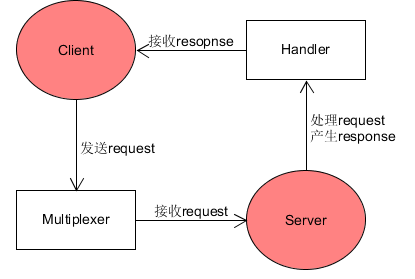

# CSwapi项目个人小结

### 个人任务
本次的项目中我主要负责服务端的`API`设计、`jwt`产生`token`实现`用户认证`、`http服务`创建（`REST`风格）  

### API设计

### jwt用户认证

### http服务创建
**URL解析**  
#### 用`gorilla/mux`库 进行 `HTTP 请求路由`和`验证`  
Go `net/http`包中存在`http.ServeMux`结构类型，可以创建一个默认的`ServeMux`（多路复用路由）`DefaultServerMux`，以处理来自`Client`的`request`并产生`response`，处理流程大致如下：  

  
  
然后调用`net/http`中的`ListenAndServe`方法启动 `HTTP 服务器`  
```c
// 8080为监听端口，nil表示一个DefaultServerMux
http.ListenAndServe(":8080", nil)
```  
  
`gorilla/mux`库中包含一个`mux.router`类型，可以替代`DefaultServerMux`，用`mux.router`类型的一个实例作为`ListenAndServe`中的第二个参数。`gorilla/mux`处理`HTTP请求`更加简便，同时可以更容易通过`curl`测试应用  
  
`mux.router`扩展了`REST风格`的路由，它赋给`HTTP动词`（如：GET、POST）和`URL`末尾的`URI`（或`路径，如api/films`）相同的`权重`。`URI`  
