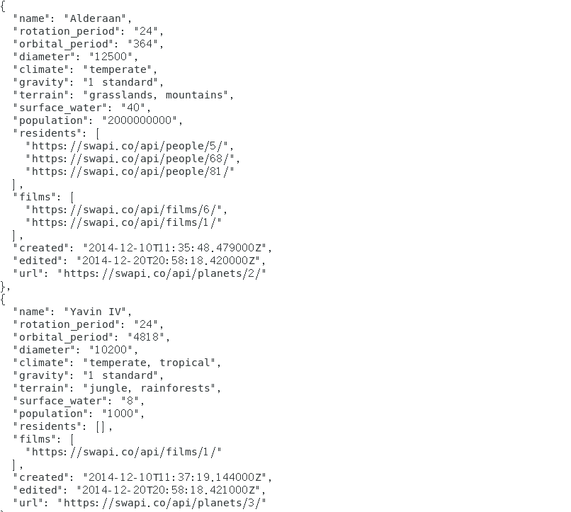
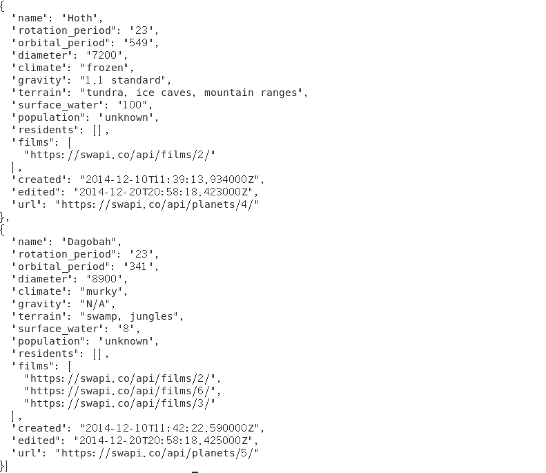
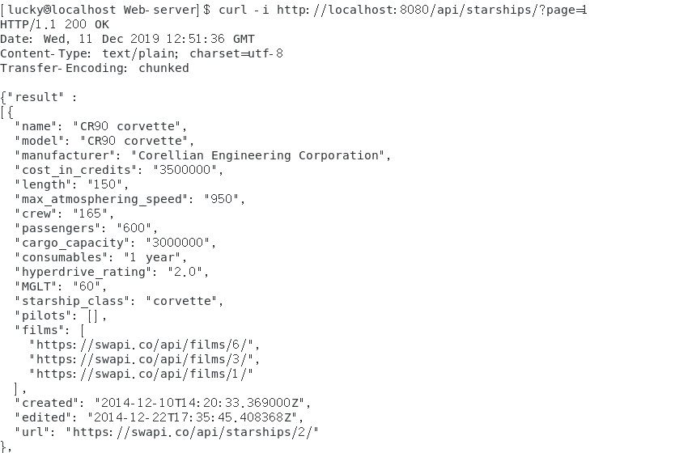
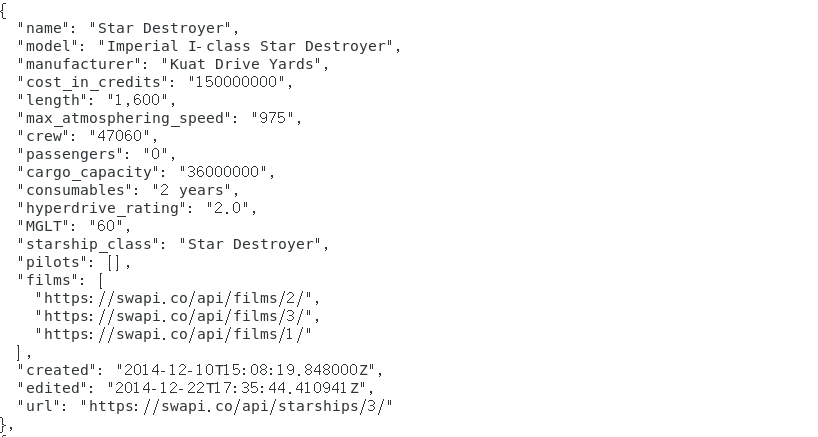
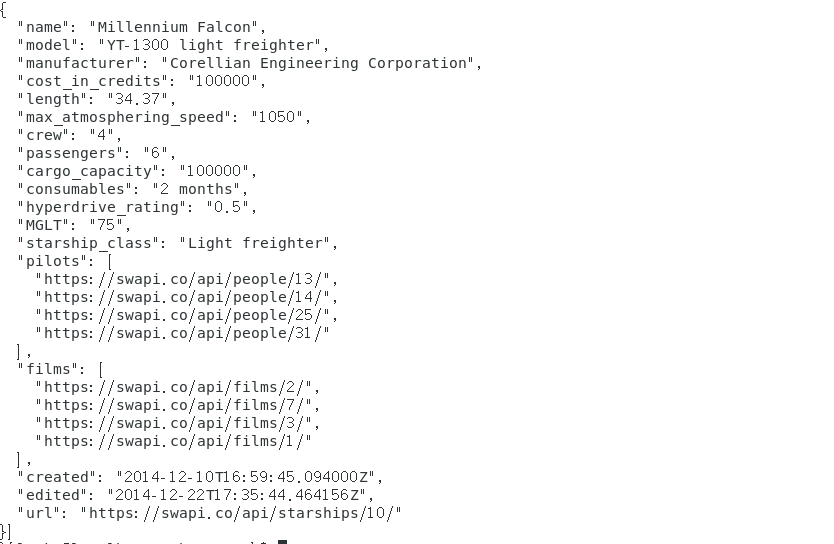
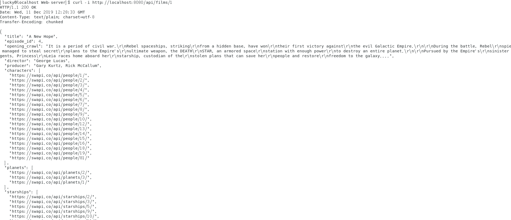

# Project-Documentation
## 项目简介
本项目为`https://swapi.co/网站`的复制版，项目名称为`Cswapi`，前端使用`vue.js`框架，后端使用`golang`实现：用`net/http`建立`http服务`，用`gorilla/mux` 库进行 `HTTP请求路由和验证`，用`Negroni`库进行`静态文件处理`（将服务器的文件托管到`web服务`上），然后用`render`包对`html`文件进行渲染；数据库采用`boltDB`；采用 `JWT` 产生 `token` 实现`用户认证`。    
#### 资源介绍
本项目所有资源全部来自`https://swapi.co/网站`，包括以下6个类型：
- `films`：单个电影，包括以下属性：
   - `title` string -- The title of this film
   - `episode_id` integer -- The episode number of this film.
   - `opening_crawl` string -- The opening paragraphs at the beginning of this film.
   - `director` string -- The name of the director of this film.
   - `producer` string -- The name(s) of the producer(s) of this film. Comma separated.
   - `release_date` date -- The ISO 8601 date format of film release at original creator country.
   - `species` array -- An array of species resource URLs that are in this film.
   - `starships` array -- An array of starship resource URLs that are in this film.
   - `vehicles` array -- An array of vehicle resource URLs that are in this film.
   - `characters` array -- An array of people resource URLs that are in this film.
   - `planets` array -- An array of planet resource URLs that are in this film.
   - `url` string -- the hypermedia URL of this resource.
   - `created` string -- the ISO 8601 date format of the time that this resource was created.
   - `edited` string -- the ISO 8601 date format of the time that this resource was edited.
- `people`：星际战争宇宙的一个个体或角色，包括以下属性：
   - `name` string -- The name of this person.
   - `birth_year` string -- The birth year of the person, using the in-universe standard of BBY or ABY - Before the Battle of Yavin or After the Battle of Yavin. The Battle of Yavin is a battle that occurs at the end of Star Wars episode IV: A New Hope.
   - `eye_color` string -- The eye color of this person. Will be "unknown" if not known or "n/a" if the person does not have an eye.
   - `gender` string -- The gender of this person. Either "Male", "Female" or "unknown", "n/a" if the person does not have a gender.
   - `hair_color` string -- The hair color of this person. Will be "unknown" if not known or "n/a" if the person does not have hair.
   - `height` string -- The height of the person in centimeters.
   - `mass` string -- The mass of the person in kilograms.
   - `skin_color` string -- The skin color of this person.
   - `homeworld` string -- The URL of a planet resource, a planet that this person was born on or inhabits.
   - `films` array -- An array of film resource URLs that this person has been in.
   - `species` array -- An array of species resource URLs that this person belongs to.
   - `starships` array -- An array of starship resource URLs that this person has piloted.
   - `vehicles` array -- An array of vehicle resource URLs that this person has piloted.
   - `url` string -- the hypermedia URL of this resource.
   - `created` string -- the ISO 8601 date format of the time that this resource was created.
   - `edited` string -- the ISO 8601 date format of the time that this resource was edited.
- `planets`：星战宇宙中在ABY为0时的一个大质量的行星或小行星。属性如下：
   - `name` string -- The name of this planet.
   - `diameter` string -- The diameter of this planet in kilometers.
   - `rotation_period` string -- The number of standard hours it takes for this planet to complete a single rotation on its axis.
   - `orbital_period` string -- The number of standard days it takes for this planet to complete a single orbit of its local star.
   - `gravity` string -- A number denoting the gravity of this planet, where "1" is normal or 1 standard G. "2" is twice or 2 standard Gs. "0.5" is half or 0.5 standard Gs.
   - `population` string -- The average population of sentient beings inhabiting this planet.
   - `climate` string -- The climate of this planet. Comma separated if diverse.
   - `terrain` string -- The terrain of this planet. Comma separated if diverse.
   - `surface_water` string -- The percentage of the planet surface that is naturally occurring water or bodies of water.
   - `residents` array -- An array of People URL Resources that live on this planet.
   - `films` array -- An array of Film URL Resources that this planet has appeared in.
   - `url` string -- the hypermedia URL of this resource.
   - `created` string -- the ISO 8601 date format of the time that this resource was created.
   - `edited` string -- the ISO 8601 date format of the time that this resource was edited.

- `species`：星球大战宇宙中的一种人或角色。属性如下：
   - `name` string -- The name of this species.
   - `classification` string -- The classification of this species, such as "mammal" or "reptile".
   - `designation` string -- The designation of this species, such as "sentient".
   - `average_height` string -- The average height of this species in centimeters.
   - `average_lifespan` string -- The average lifespan of this species in years.
   - `eye_colors` string -- A comma-separated string of common eye colors for this species, "none" if this species does not typically have eyes.
   - `hair_colors` string -- A comma-separated string of common hair colors for this species, "none" if this species does not typically have hair.
   - `skin_colors` string -- A comma-separated string of common skin colors for this species, "none" if this species does not typically have skin.
   - `language` string -- The language commonly spoken by this species.
   - `homeworld` string -- The URL of a planet resource, a planet that this species originates from.
   - `people` array -- An array of People URL Resources that are a part of this species.
   - `films` array -- An array of Film URL Resources that this species has appeared in.
   - `url` string -- the hypermedia URL of this resource.
   - `created` string -- the ISO 8601 date format of the time that this resource was created.
   - `edited` string -- the ISO 8601 date format of the time that this resource was edited.
- `starships`：一艘拥有超光速能力的运输飞船。属性如下：    
   - `name` string -- The name of this starship. The common name, such as "Death Star".
   - `model` string -- The model or official name of this starship. Such as "T-65 X-wing" or "DS-1 Orbital Battle Station".
   - `starship_class` string -- The class of this starship, such as "Starfighter" or "Deep Space Mobile Battlestation"
   - `manufacturer` string -- The manufacturer of this starship. Comma separated if more than one.
   - `cost_in_credits` string -- The cost of this starship new, in galactic credits.
   - `length` string -- The length of this starship in meters.
   - `crew` string -- The number of personnel needed to run or pilot this starship.
   - `passengers` string -- The number of non-essential people this starship can transport.
   - `max_atmosphering_speed` string -- The maximum speed of this starship in the atmosphere. "N/A" if this starship is incapable of atmospheric flight.
   - `hyperdrive_rating` string -- The class of this starships hyperdrive.
   - `MGLT` string -- The Maximum number of Megalights this starship can travel in a standard hour. A "Megalight" is a standard unit of distance and has never been defined before within the Star Wars universe. This figure is only really useful for measuring the difference in speed of starships. We can assume it is similar to AU, the distance between our Sun (Sol) and Earth.
   - `cargo_capacity` string -- The maximum number of kilograms that this starship can transport.
   - `consumables` *string
The maximum length of time that this starship can provide consumables for its entire crew without having to resupply.
   - `films` array -- An array of Film URL Resources that this starship has appeared in.
   - `pilots` array -- An array of People URL Resources that this starship has been piloted by.
   - `url` string -- the hypermedia URL of this resource.
   - `created` string -- the ISO 8601 date format of the time that this resource was created.
   - `edited` string -- the ISO 8601 date format of the time that this resource was edited.  

- `vehicles`：一种没有超光速能力的运输工具。属性如下：  
   - `name` string -- The name of this vehicle. The common name, such as "Sand Crawler" or "Speeder bike".
   - `model` string -- The model or official name of this vehicle. Such as "All-Terrain Attack Transport".
   - `vehicle_class` string -- The class of this vehicle, such as "Wheeled" or "Repulsorcraft".
   - `manufacturer` string -- The manufacturer of this vehicle. Comma separated if more than one.
   - `length` string -- The length of this vehicle in meters.
   - `cost_in_credits` string -- The cost of this vehicle new, in Galactic Credits.
   - `crew` string -- The number of personnel needed to run or pilot this vehicle.
   - `passengers` string -- The number of non-essential people this vehicle can transport.
   - `max_atmosphering_speed` string -- The maximum speed of this vehicle in the atmosphere.
   - `cargo_capacity` string -- The maximum number of kilograms that this vehicle can transport.
   - `consumables` *string
The maximum length of time that this vehicle can provide consumables for its entire crew without having to resupply.
   - `films` array -- An array of Film URL Resources that this vehicle has appeared in.
   - `pilots` array -- An array of People URL Resources that this vehicle has been piloted by.
   - `url` string -- the hypermedia URL of this resource.
   - `created` string -- the ISO 8601 date format of the time that this resource was created.
   - `edited` string -- the ISO 8601 date format of the time that this resource was edited.

#### 客户端github仓库
https://github.com/Cswapi/Web-Client
#### 服务端github仓库
https://github.com/Cswapi/Web-Server

## 前端安装
前端使用`vue`框架搭建，`npm`安装框架
- 首先安装npm：`sudo apt install npm`(依赖`nodejs`，所以需要先安装node)
- 然后安装`vue-cli`脚手架：`sudo npm install -g vue-cli`（-g为安装到全局）
   - node和npm版本要在`4`以上（node -v, npm -v）
   - 由于最初的源使用`npm install`命令时非常的慢，所以可以通过命令`npm config set registry https://registry.npm.taobao.org`切换阿里的源
   - 通过`npm config get registry`查看npm的源  
- 然后进入`vue项目`中（含vue的`目录结构`），通过命令`npm install`安装依赖  
- 通过命令`npm run dev`在本地端口`8080`启动项目
## 后端安装
后端使用`golang`实现，`go get`安装  
`go get github.com/Cswapi/Web-Server`  
  
进入本地go工作目录的`github.com/Cswapi/Web-Server`使用命令：`go run main.go`运行服务端，监听8080端口

## 页面设计
本项目设计了以下三个页面：  

`用户注册页面`  
  

`用户登陆页面`  
  

`资源搜索页面`  
  

## API设计
本项目参考`swapi`，实现了相应的6个基本的获取资源的`服务API`，同时增加了`用户注册`和`用户登陆`的API，下面是API介绍与测试：  
先运行Web-Server  
### 资源获取API
使用`GET`请求  
1. 获取每种资源的首页信息：
   - `http://localhost:8080/api/films/`
   - `http://localhost:8080/api/people/`
   - `http://localhost:8080/api/planets/`
   - `http://localhost:8080/api/species/`
   - `http://localhost:8080/api/starships/`
   - `http://localhost:8080/api/vehicles/`    

    测试：
    
      
     
  
2. 分页获取每种资源的信息：
   - `http://localhost:8080/api/films/?pages=%d`
   - `http://localhost:8080/api/people/?pages=%d`
   - `http://localhost:8080/api/planets/?pages=%d`
   - `http://localhost:8080/api/species/?pages=%d`
   - `http://localhost:8080/api/starships/?pages=%d`
   - `http://localhost:8080/api/vehicles/?pages=%d`
  
    测试：
      
    
    
      
       

3. 分条获取每种资源的信息：  
   - `http://localhost:8080/api/films/%d`
   - `http://localhost:8080/api/people/%d`
   - `http://localhost:8080/api/planets/%d`
   - `http://localhost:8080/api/species/%d`
   - `http://localhost:8080/api/starships/%d`
   - `http://localhost:8080/api/vehicles/%d`  

    测试：  

        

### 用户注册API  
使用`POST`请求  
`http://localhost:8080/register`  

测试：  

  
 

### 用户登陆API  
使用`POST`请求  
`http://localhost:8080/login`  

测试：  

  
  

## 项目成员

|姓名|学号|负责工作|
|:---|:---|:---|
|陆记|17343080|`API设计`、`http服务搭建`|
|陆宇霄|17343082|前端服务器的架构：搜索、翻页|
|马睿明君|17343084|前端服务器的架构：用户|
|牛凌宇|17343091|服务器数据库`boltDB`搭建|
